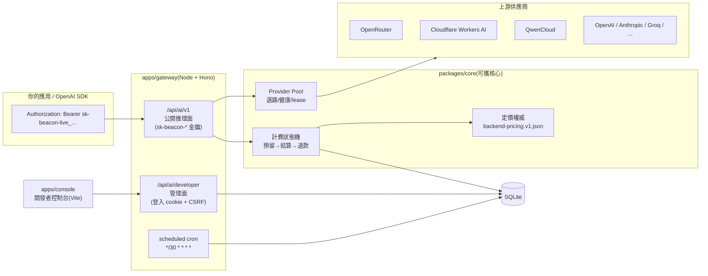

# Beacon Gateway

**English.** Beacon Gateway is a self-hosted, OpenAI-compatible AI gateway: USD-based billing, multi-provider pooling with automatic failover, `sk-beacon-*` API keys, and a built-in Traditional-Chinese developer console. Core (`packages/core`) is a portable TypeScript library; the gateway runs as a plain Node.js server on SQLite (no external database) **or on Cloudflare Workers inside a Durable Object**; the console is a React + Vite app deployable to Cloudflare Pages.

```bash
cp apps/gateway/.dev.vars.example apps/gateway/.dev.vars   # fill in secrets
npm install
npm run migrate                 # schema v2 + admin account
npm run dev:gateway             # http://localhost:8787
npm run dev:console             # http://localhost:5173
```

See [Quick start](#快速開始) below, [docs/DEPLOYMENT.md](docs/DEPLOYMENT.md) for production, and [docs/openapi.yaml](docs/openapi.yaml) for the full API contract. MIT licensed.

---

**Beacon Gateway** 是一個可完全自架的 OpenAI 相容 AI 閘道:以「美元」直接計費(內部微美元整數結算),後方串接多家模型供應商(自動選路、健康狀態、故障轉移),並附帶繁體中文開發者控制台。資料庫使用 SQLite 單檔(Node 22 內建 `node:sqlite`,免裝任何資料庫服務)。整個系統由三個部分組成,全部 TypeScript:

| 目錄 | 說明 |
| --- | --- |
| `packages/core` | 可攜行為核心:定價權威、美元計費(預留/結算/退款,微美元整數)、API 金鑰(HMAC + pepper)、供應商池選路、SSE 解析、schema 版本化遷移 |
| `apps/gateway` | Gateway(Hono):Node server(`@hono/node-server` + `node:sqlite`)或 Cloudflare Workers(單一 Durable Object + `storage.sql`);對外暴露 OpenAI 相容 API、開發者管理面、內建帳號系統、定時對帳 |
| `apps/console` | 開發者控制台(React + Vite):金鑰管理、串流測試、模型目錄、用量紀錄,含離線示範模式 |

## 功能特性

- **OpenAI 相容 API**:`GET /api/ai/v1/models`、`POST /api/ai/v1/chat/completions`(支援 SSE 串流、`Idempotency-Key` 冪等),任何 OpenAI SDK 指向 `baseURL` 即可使用。
- **美元計費**:內部以微美元整數結算(無浮點誤差),請求前「預留」消費上限、完成後依實際 usage 結算、差額自動退回;全流程冪等、可重跑、可對帳。
- **多供應商池**:37 條 credential 設定(openrouter、cloudflare-workers-ai、qwencloud、openai、anthropic、groq…),加權輪詢、健康冷卻、in-flight lease、自動 fallback;secret 只存環境變數名稱,資料庫僅存 opaque credential ID。
- **API 金鑰管理**:`sk-beacon-live_/sk-beacon-test_` 金鑰、只顯示一次、pepper-HMAC digest 落庫;可設定過期時間、模型白名單、RPM、最大併發與美元消費上限。金鑰級 RPM/併發由資料庫交易內原子計數強制;登入與金鑰管理的 IP 限流同樣以 SQLite 固定窗口計數(單程序全域生效),資料庫不可用時降級為 in-process 記憶體視窗。
- **內建帳號系統**:註冊/登入(JWT cookie + CSRF 雙提交)、migrate 時可種子管理員、新戶送點、可關閉公開註冊。
- **開發者控制台**:總覽、金鑰、串流測試(逐字渲染、usage 統計)、模型目錄(含免費額度)、請求紀錄與單筆詳情;提供 `?demo=1` 離線示範模式。
- **契約測試護欄**:openapi.yaml、前後端 catalog、路由與安全不變式都有測試釘死,漂移即擋建置。Biome lint/format 與 `npm audit`(high 以上)同樣在 CI 強制。

## 架構



## 快速開始

需求:Node ≥ 22.18(內建 `node:sqlite`,且測試以 `node --test` 直接執行 TypeScript)。不需要 Docker、不需要外部資料庫。

```bash
# 1. 設定環境
cp apps/gateway/.dev.vars.example apps/gateway/.dev.vars
#   填入 BEACON_DB_PATH=./beacon.db(或不填,預設即此)
#   並產生 JWT_SECRET / BEACON_API_KEY_PEPPER(openssl rand -hex 32)
#   填入 ADMIN_EMAIL / ADMIN_PASSWORD(管理員種子)
#   填入至少一個供應商金鑰(例如 OPENROUTER_API_KEY_1)

# 2. 安裝依賴並初始化資料庫(schema v2 + 帳號表 + 管理員)
npm install
npm run migrate

# 3. 啟動 gateway 與控制台
npm run dev:gateway    # http://localhost:8787
npm run dev:console    # http://localhost:5173
#   console 開發時請在 apps/console/.env 設
#   VITE_BEACON_API_BASE=http://127.0.0.1:8787/api(gateway 的 CORS 已允許 localhost:5173)
```

控制台打開 http://localhost:5173 ,登入管理員帳號後即可建立 API 金鑰、測試串流。
沒有供應商金鑰也沒關係:控制台支援 **`http://localhost:5173/?demo=1`** 離線示範模式,
所有功能(金鑰管理、串流測試、用量)都能以模擬資料操作。

### 用 OpenAI SDK 呼叫

```ts
import OpenAI from 'openai';

const client = new OpenAI({
  apiKey: 'sk-beacon-live_…',          // 在控制台建立
  baseURL: 'http://localhost:8787/api/ai/v1',
});

const stream = await client.chat.completions.create({
  model: 'beacon/llama-3.2-1b-instruct',  // 模型目錄見控制台「模型」頁
  messages: [{ role: 'user', content: '你好!' }],
  stream: true,
});
```

## 部署

兩種支援的 gateway 拓撲(console 都是靜態站,可放 Cloudflare Pages 或任意靜態主機):

**A. 自架伺服器(Node ≥ 22.18)** — 完整程序(遷移、煙霧測試、對帳、備份)見
[docs/DEPLOYMENT.md](docs/DEPLOYMENT.md)。摘要:

```bash
npm run build        # 建置 console
npm run migrate      
npm run start:gateway
```

以 systemd/pm2 常駐即可;資料庫是單一 SQLite 檔,備份 = 停機瞬間複製檔案(或使用
`sqlite3 .backup`)。**僅限單實例**:計費與限流依賴單一資料庫 + 程序內序列化。

**B. Cloudflare Workers + Pages** — gateway 整個跑在單一 SQLite-backed Durable
Object 內(cron 取代程序內對帳迴圈,遷移在首次請求前自動執行):

```bash
cd apps/gateway
npx wrangler deploy          # secrets 以 wrangler secret put 設定
# console 建置後上傳 apps/console/dist 到 Cloudflare Pages
```

設定、secrets 與注意事項見 [docs/DEPLOYMENT.md](docs/DEPLOYMENT.md) 的
「Topology B: Cloudflare Workers」章節。

## 設定

| 環境變數 | 必填 | 說明 |
| --- | --- | --- |
| `BEACON_DB_PATH` | 建議 | SQLite 資料庫檔案路徑(預設 `./beacon.db`,相對 `apps/gateway/`) |
| `JWT_SECRET` | ✅ | 會話 cookie 簽名金鑰(≥32 bytes) |
| `BEACON_API_KEY_PEPPER` | ✅ | API 金鑰 HMAC pepper(≥32 bytes) |
| `BEACON_ENABLED` | 建議 | fail-closed 開關;僅 `true` 時啟用 `/api/ai/*` |
| `ADMIN_EMAIL` / `ADMIN_PASSWORD` | 選配 | migrate 時的管理員種子 |
| `BEACON_SIGNUP_BONUS_USD` | 選配 | 註冊初始餘額(預設 $5.00) |
| `BEACON_ADMIN_STARTING_CREDITS_USD` | 選配 | 管理員初始餘額(預設 $500.00) |
| `BEACON_SIGNUP_BONUS_POINTS` | 選配 | 註冊送點(預設 1000) |
| `BEACON_DISABLE_REGISTRATION` | 選配 | 設 `true` 關閉公開註冊 |
| `FRONTEND_ORIGINS` | 建議 | 允許帶 cookie 的 console 來源(CSV) |
| `OPENROUTER_API_KEY_1` … | 選配 | 供應商上游金鑰,見 `docs/PROVIDERS.md` |

完整清單見 `apps/gateway/.dev.vars.example`。

## 文件

| 文件 | 內容 |
| --- | --- |
| [docs/openapi.yaml](docs/openapi.yaml) | 公開 API 與管理面完整契約(OpenAPI 3.1) |
| [docs/PROVIDERS.md](docs/PROVIDERS.md) | 各上游供應商的 API 形態、參數怪癖、價格表、新增供應商程序 |
| [docs/DEPLOYMENT.md](docs/DEPLOYMENT.md) | 部署 runbook:綁定、遷移、煙霧測試、對帳、canary、回滾 |
| [docs/ADR-0001-rebuild-boundaries.md](docs/ADR-0001-rebuild-boundaries.md) | 架構決策:契約權威、設定分離、安全與計費邊界 |
| [docs/BRAND_ASSETS.md](docs/BRAND_ASSETS.md) | 品牌圖示政策(第三方商標不隨 repo 散布) |

## 安全模型(摘要)

- 金鑰明文只在建立/輪替時回傳一次;資料庫只存 prefix/suffix 遮罩與 HMAC-SHA256(pepper) digest。
- prompt、completion、完整金鑰與供應商 token 不落地:不入庫、不入 log、不進錯誤回應(契約測試釘死)。
- 供應商 secret 只存在 runtime 環境變數;資料庫僅存 opaque credential ID 與健康狀態。
- 計費全流程冪等,crash 後由定時任務對帳(過期預留自動退款、隔離單自動退款出口)。

發現安全問題請見 [SECURITY.md](SECURITY.md),請勿以 issue 回報。

## 授權

[MIT](LICENSE)。第三方品牌名稱與商標屬各自權利人所有(見 [docs/BRAND_ASSETS.md](docs/BRAND_ASSETS.md))。
