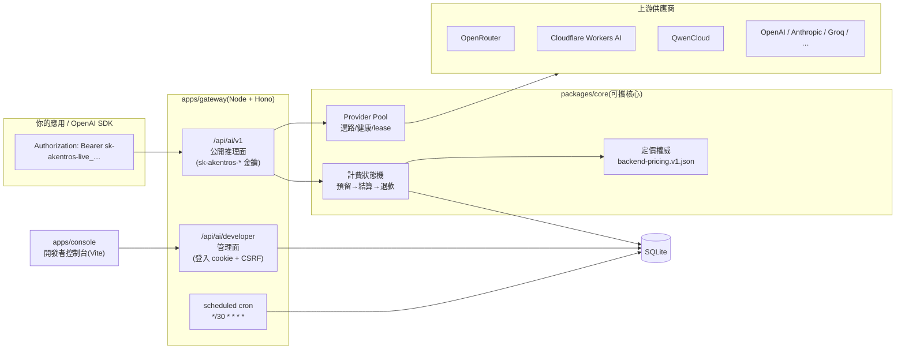

# Akentros Gateway

**English.** Akentros Gateway is a self-hosted, OpenAI-compatible AI gateway: USD-based billing, multi-provider pooling with automatic failover, `sk-akentros-*` API keys, and a built-in Traditional-Chinese developer console. Core (`packages/core`) is a portable TypeScript library; the gateway runs as a plain Node.js server on SQLite (no external database), on PostgreSQL — from a long-lived VPS to serverless platforms (Neon's WebSocket driver, Cloudflare Hyperdrive) — **or on Cloudflare Workers inside a Durable Object**; the console is a React + Vite app deployable to Cloudflare Pages.

```bash
cp apps/gateway/.dev.vars.example apps/gateway/.dev.vars   # fill in secrets
npm install
npm run migrate                 # schema v3 + admin account
npm run dev:gateway             # http://localhost:8787
npm run dev:console             # http://localhost:5173
```

See [Quick start](#快速開始) below, [docs/DEPLOYMENT.md](docs/DEPLOYMENT.md) for production, and [docs/openapi.yaml](docs/openapi.yaml) for the full API contract. MIT licensed.

---

**Akentros Gateway** 是一個可完全自架的 OpenAI 相容 AI 閘道:以「美元」直接計費(內部微美元整數結算),後方串接多家模型供應商(自動選路、健康狀態、故障轉移),並附帶繁體中文開發者控制台。資料庫預設為 SQLite 單檔(Node 22 內建 `node:sqlite`,免裝任何資料庫服務),亦可切換 PostgreSQL——從常駐 VPS 到無伺服器平台(Neon WebSocket 驅動、Vercel/Netlify 函式、Cloudflare Hyperdrive)皆可。整個系統由三個部分組成,全部 TypeScript:

| 目錄 | 說明 |
| --- | --- |
| `packages/core` | 可攜行為核心:定價權威、美元計費(預留/結算/退款,微美元整數)、API 金鑰(HMAC + pepper)、供應商池選路、SSE 解析、schema 版本化遷移 |
| `apps/gateway` | Gateway(Hono):Node server(`@hono/node-server` + `node:sqlite`)或 Cloudflare Workers(單一 Durable Object + `storage.sql`);對外暴露 OpenAI 相容 API、開發者管理面、內建帳號系統、定時對帳 |
| `apps/console` | 開發者控制台(React + Vite):金鑰管理、串流測試、模型目錄、用量紀錄,含離線示範模式 |

## 功能特性

- **OpenAI 相容 API**:`GET /api/ai/v1/models`、`POST /api/ai/v1/chat/completions`(支援 SSE 串流、`Idempotency-Key` 冪等)、`POST /api/ai/v1/embeddings`(文字向量,僅計輸入 token)、`POST /api/ai/v1/responses`(新 SDK 預設介面的橋接子集,詳見下方相容性矩陣),任何 OpenAI SDK 指向 `baseURL` 即可使用。**冪等語意**:OpenAI 對已完成的冪等鍵會「重放原始回應」;Akentros 預設不落地 prompt/completion,已完成鍵重送回 `409 idempotent_request_replayed`(附原始 `X-Request-Id`)。需要 OpenAI 式重放的場景,可在金鑰上 opt-in(`idempotency_replay_ttl_seconds`,最長 7 天):成功回應(JSON 與 SSE)落地該時限,完成鍵重送且請求體一致時直接重放(`X-Akentros-Idempotent-Replay: true`),不再執行、不再計費;時限屆滿後綁定自動釋放,同鍵同體重送視為全新請求重新執行並重新落地(TTL 是重放窗口,不是金鑰的死刑,與 OpenAI 生命週期一致);超過 2MB 落地上限的回應改存墓碑標記,時限內同鍵重送回可分辨的 `409 idempotency_replay_not_stored`(不重放、不重新執行、不雙重扣費),時限過後同樣釋放;進行中鍵回 `409 idempotent_request_in_progress`、同鍵不同請求體回 `409 idempotency_conflict`(見 `docs/openapi.yaml` 的 `Idempotency-Key` 參數說明)。
- **美元計費**:內部以微美元整數結算(無浮點誤差),請求前「預留」消費上限、完成後依實際 usage 結算、差額自動退回;全流程冪等、可重跑、可對帳。
- **多供應商池**:37 條 credential 設定(openrouter、cloudflare-workers-ai、qwencloud、openai、anthropic、groq…),加權輪詢、健康冷卻、in-flight lease、自動 fallback;secret 只存環境變數名稱,資料庫僅存 opaque credential ID。
- **無伺服器 PostgreSQL**:`DATABASE_URL` 指向 PG 時,驅動依環境自動選擇——TCP `pg` 連線池(Node VPS、Render、Vercel/Netlify Node 函式,遠端主機自動 TLS、無伺服器環境每實例一條連線)或 Neon 相容 WebSocket 驅動(`*.neon.tech` 自動啟用;邊緣 runtime、Cloudflare Workers 直連,支援自架 `AKENTROS_PG_WS_PROXY` 閘道);Workers 另可經 Hyperdrive 綁定走 TCP。兩種驅動共用同一套互動式交易語意(`FOR UPDATE` 行鎖、`pg_advisory_xact_lock`),計費不變式不因拓撲妥協。詳見 `docs/DEPLOYMENT.md` 的 Topology C。
- **API 金鑰管理**:`sk-akentros-live_/sk-akentros-test_` 金鑰、只顯示一次、pepper-HMAC digest 落庫;可設定過期時間、模型白名單、RPM、最大併發與美元消費上限。金鑰級 RPM/併發由資料庫交易內原子計數強制;登入與金鑰管理的 IP 限流同樣以 SQLite 固定窗口計數(單程序全域生效),資料庫不可用時降級為 in-process 記憶體視窗。
- **內建帳號系統**:註冊/登入(JWT cookie + CSRF 雙提交,pre-auth 端點另以 Origin/Referer 檢查擋 login CSRF)、migrate 時可種子管理員、新戶送點、可關閉公開註冊。
- **開發者控制台**:總覽、金鑰、串流測試(逐字渲染、usage 統計)、模型目錄(含免費額度)、請求紀錄與單筆詳情;提供 `?demo=1` 離線示範模式。
- **維運探針與結構化日誌**:`GET /healthz` 回報程序與資料庫狀態(200 ok / 503 degraded),供負載平衡與監控探測;Node 自架拓撲另提供 `GET /metrics`(Prometheus 文字格式:請求數、延遲、token 用量、消費金額,`AKENTROS_METRICS_ENABLED=false` 可關閉);內部日誌以單行 JSON 輸出,可直接交由 Cloudflare observability、journald 等採集。
- **契約測試護欄**:openapi.yaml、前後端 catalog、路由與安全不變式都有測試釘死,漂移即擋建置。Biome lint/format 與 `npm audit`(high 以上)同樣在 CI 強制。

### OpenAI 端點相容性矩陣

自 LiteLLM / one-api 遷移前,先對照本表(權威清單以 `docs/openapi.yaml` 的 `info.description` 為準,契約測試釘死兩邊一致):

| OpenAI 端點 | 支援 | 備註 |
| --- | :---: | --- |
| `GET /v1/models` | ✅ | |
| `POST /v1/chat/completions` | ✅ | SSE 串流、工具呼叫、`response_format`(`text` 放行;`json_object`/`json_schema` 依模型能力旗標 `json_mode`/`structured_outputs` 透傳) |
| `POST /v1/embeddings` | ✅ | 僅文字輸入,僅計輸入 token |
| `POST /v1/responses` | ✅ | 橋接子集:`model`/`input`(含 vision 的 `input_text`/`input_image`)/`instructions`/`stream`/`max_output_tokens`/`temperature`/`top_p`,內部走 chat 管線計費,包回 Responses 物件與 `response.*` SSE 事件;`background`、`previous_response_id`、`tools` 等進階功能回 `400 unsupported_feature` |
| legacy `POST /v1/completions` | ❌ | 已汰換格式,明確不支援 |
| `/v1/audio/*`(語音/轉錄) | ❌ | 非 token 計費模型,未規劃 |
| `/v1/images/*`(生成/編輯/變體) | ❌ | 非 token 計費模型,未規劃 |
| `/v1/moderations` | ❌ | |
| `/v1/files`、`/v1/batches` | ❌ | |
| `/v1/realtime` | ❌ | |

參數面對策:SDK 預設呼叫可直接使用;`user`、`store`、`metadata`、`service_tier` 等對閘道中立的參數接受後丟棄(不轉發、不報錯);`logprobs`、`parallel_tool_calls` 等語意相關參數回 `400 unsupported_parameter` 並指名欄位;`n>1` 回 `400 unsupported_feature` 並提示改送獨立請求。`/v1/responses` 的 `input` 支援字串或訊息陣列(含 vision 模型的 `input_image` parts)。

## 架構


```mermaid
flowchart LR
    subgraph client["你的應用 / OpenAI SDK"]
        A["Authorization: Bearer sk-akentros-live_…"]
    end
    subgraph worker["apps/gateway(Node + Hono)"]
        P["/api/ai/v1\n公開推理面\n(sk-akentros-* 金鑰)"]
        D["/api/ai/developer\n管理面\n(登入 cookie + CSRF)"]
        S["scheduled cron\n*/30 * * * *"]
    end
    subgraph core["packages/core(可攜核心)"]
        B["計費狀態機\n預留→結算→退款"]
        R["Provider Pool\n選路/健康/lease"]
        PR["定價權威\nbackend-pricing.v1.json"]
    end
    DB[("SQLite")]
    subgraph providers["上游供應商"]
        P1["OpenRouter"]
        P2["Cloudflare Workers AI"]
        P3["QwenCloud"]
        P4["OpenAI / Anthropic / Groq / …"]
    end
    C["apps/console\n開發者控制台(Vite)"] --> D
    A --> P
    P --> B --> DB
    P --> R --> providers
    B --> PR
    D --> DB
    S --> DB
```

## 快速開始

需求:Node ≥ 22.18(內建 `node:sqlite`,且測試以 `node --test` 直接執行 TypeScript)。不需要 Docker、不需要外部資料庫。

```bash
# 1. 設定環境
cp apps/gateway/.dev.vars.example apps/gateway/.dev.vars
#   填入 AKENTROS_DB_PATH=./akentros.db(或不填,預設即此)
#   並產生 JWT_SECRET / AKENTROS_API_KEY_PEPPER(openssl rand -hex 32)
#   填入 ADMIN_EMAIL / ADMIN_PASSWORD(管理員種子)
#   填入至少一個供應商金鑰(例如 OPENROUTER_API_KEY_1)

# 2. 安裝依賴並初始化資料庫(schema v3 + 帳號表 + 管理員)
npm install
npm run migrate

# 3. 啟動 gateway 與控制台
npm run dev:gateway    # http://localhost:8787
npm run dev:console    # http://localhost:5173
#   console 開發時請在 apps/console/.env 設
#   VITE_AKENTROS_API_BASE=http://127.0.0.1:8787/api(gateway 的 CORS 已允許 localhost:5173)
```

控制台打開 http://localhost:5173 ,登入管理員帳號後即可建立 API 金鑰、測試串流。
沒有供應商金鑰也沒關係:控制台支援 **`http://localhost:5173/?demo=1`** 離線示範模式,
所有功能(金鑰管理、串流測試、用量)都能以模擬資料操作。

### 用 OpenAI SDK 呼叫

```ts
import OpenAI from 'openai';

const client = new OpenAI({
  apiKey: 'sk-akentros-live_…',          // 在控制台建立
  baseURL: 'http://localhost:8787/api/ai/v1',
});

const stream = await client.chat.completions.create({
  model: 'akentros/gpt-5.2',  // 模型目錄見控制台「模型」頁
  messages: [{ role: 'user', content: '你好!' }],
  stream: true,
});
```

## 部署

兩種支援的 gateway 拓撲(console 都是靜態站,可放 Cloudflare Pages 或任意靜態主機):

**A. 自架伺服器(Node ≥ 22.18)** — 完整程序(遷移、煙霧測試、對帳、備份)見
[docs/DEPLOYMENT.md](docs/DEPLOYMENT.md)。摘要:

```bash
npm run build        # 建置 console
npm run migrate      
npm run start:gateway
```

以 systemd/pm2 常駐即可;資料庫是單一 SQLite 檔,備份 = 停機瞬間複製檔案(或使用
`sqlite3 .backup`)。**僅限單實例**:計費與限流依賴單一資料庫 + 程序內序列化。

**B. Cloudflare Workers + Pages** — gateway 整個跑在單一 SQLite-backed Durable
Object 內(cron 取代程序內對帳迴圈,遷移在首次請求前自動執行):

```bash
cd apps/gateway
npx wrangler deploy          # secrets 以 wrangler secret put 設定
# console 建置後上傳 apps/console/dist 到 Cloudflare Pages
```

設定、secrets 與注意事項見 [docs/DEPLOYMENT.md](docs/DEPLOYMENT.md) 的
「Topology B: Cloudflare Workers」章節。

## 設定

| 環境變數 | 必填 | 說明 |
| --- | --- | --- |
| `AKENTROS_DB_PATH` | 建議 | SQLite 資料庫檔案路徑(預設 `./akentros.db`,相對 `apps/gateway/`;相對路徑一律以此目錄為基準,不受啟動目錄影響) |
| `AKENTROS_HOST` / `HOST` | 選配 | Node 自架的綁定位址(預設 `127.0.0.1` 僅接上 loopback;反向代理、容器等需對外時明確設為 `0.0.0.0` 或特定介面位址) |
| `DATABASE_URL` | 選配 | 設為 `postgres://…`(或 `postgresql://…`)時改用 PostgreSQL(`npm run migrate` 同樣自動切換);未設或非 PG scheme 時走 SQLite。驅動自動選擇:`*.neon.tech` 主機或設有 `AKENTROS_PG_WS_PROXY` 時走 Neon 相容 WebSocket 無伺服器驅動,其餘走 TCP `pg` 連線池(Workers 部署可改設 Hyperdrive 綁定,見 `docs/DEPLOYMENT.md` Topology B/C)。限流與 schema 檢查一律優先使用已安裝的資料庫 adapter,連線失敗才降級 |
| `AKENTROS_PG_DRIVER` | 選配 | PG 驅動總開關:`auto`(預設,依 URL 特徵自動選)| `pg-pool`(TCP `pg`,含 Hyperdrive)| `neon`(Neon 相容 WebSocket 無伺服器驅動;別名 `neon-ws`/`serverless`)。無效值 fail-fast |
| `AKENTROS_PG_SSL` | 選配 | TLS 模式:`disable` \| `require` \| `verify-full`;預設 `auto`——沿用連線字串的 `sslmode`,遠端主機自動 `require`(不驗證),localhost/內網/unix socket 不加密 |
| `AKENTROS_PG_WS_PROXY` | 選配 | 自架 pg-gateway/supavisor 相容的 WebSocket 閘道位址(靜態 `host[:port][/path]` 或含 `{host}` 的模板);設定即改用 neon 驅動 |
| `AKENTROS_PG_WS_SECURE` | 選配 | WS 閘道是否走 `wss`(預設 `true`;僅閘道位於 TLS 終結之後的本地開發場景設 `false`) |
| `AKENTROS_PG_POOL_MAX` | 選配 | PG 連線池上限(無伺服器函式環境預設每實例 1 條,常駐程序預設 10) |
| `JWT_SECRET` | ✅ | 會話 cookie 簽名金鑰(≥32 bytes) |
| `AKENTROS_API_KEY_PEPPER` | ✅ | API 金鑰 HMAC pepper(≥32 bytes) |
| `AKENTROS_ENABLED` | 建議 | fail-closed 開關;僅 `true` 時啟用 `/api/ai/*` |
| `ADMIN_EMAIL` / `ADMIN_PASSWORD` | 選配 | migrate 時的管理員種子 |
| `AKENTROS_SIGNUP_BONUS_USD` | 選配 | 註冊初始餘額(預設 $5.00) |
| `AKENTROS_ADMIN_STARTING_CREDITS_USD` | 選配 | 管理員初始餘額(預設 $500.00) |
| `AKENTROS_DISABLE_REGISTRATION` | 選配 | 設 `true` 關閉公開註冊 |
| `AKENTROS_SIGNUP_ANTI_ENUMERATION` | 選配 | 防帳號枚舉(預設開啟):不論信箱是否已註冊,一律回同形 202 受理訊息(狀態碼、主體、cookie 完全一致)、不發 session、不回 user,回應時間與成功路徑等化;僅內部可達的私有部署可設 `false` 還原「新註冊 201 自動登入/重複 409 `email_taken`」UX |
| `AKENTROS_TRUST_PROXY` | 選配 | 信任反向代理的宣告:設 `true` 表示 gateway 前方有會「覆寫」標頭的受信賴代理(如 Cloudflare、nginx)。此時登入/註冊限流以 `cf-connecting-ip` 判定用戶端 IP,其次 `x-forwarded-for` **最後一值**(SN-2 fix:不設 `cf-connecting-ip` 的 nginx 類代理此前會退化為全站共用單一限流桶,60 次/15 分鐘即鎖死所有登入);pre-auth 同源檢查改以 `x-forwarded-proto`/`x-forwarded-host` 的最後一值重建自身來源(TLS 終止代理後 `c.req.url` 仍是 http:,瀏覽器 Origin 卻是 https:,需標頭才能正確判同源)。未設定的 Node 自架一律以不可偽造的 socket 位址/URL 為準,標頭不採信;身分完全退化時輸出 `akentros_auth_rate_limit_identity_degraded` 告警。**反向代理部署必須設 `AKENTROS_TRUST_PROXY=true` 並要求代理覆寫身分標頭**(nginx:`proxy_set_header cf-connecting-ip $remote_addr;` 或正確附加 `X-Forwarded-For`),否則全站共用代理 IP 的限流桶。Cloudflare Workers 部署一律以標頭為準 |
| `FRONTEND_ORIGINS` | 建議 | 允許帶 cookie 的 console 來源(CSV) |
| `OPENROUTER_API_KEY_1` … | 選配 | 供應商上游金鑰,見 `docs/PROVIDERS.md` |

完整清單見 `apps/gateway/.dev.vars.example`。

## 文件

| 文件 | 內容 |
| --- | --- |
| [docs/openapi.yaml](docs/openapi.yaml) | 公開 API 與管理面完整契約(OpenAPI 3.1) |
| [docs/PROVIDERS.md](docs/PROVIDERS.md) | 各上游供應商的 API 形態、參數怪癖、價格表、新增供應商程序 |
| [docs/DEPLOYMENT.md](docs/DEPLOYMENT.md) | 部署 runbook:綁定、遷移、煙霧測試、對帳、canary、回滾 |
| [docs/ADR-0001-rebuild-boundaries.md](docs/ADR-0001-rebuild-boundaries.md) | 架構決策:契約權威、設定分離、安全與計費邊界 |
| [docs/BRAND_ASSETS.md](docs/BRAND_ASSETS.md) | 品牌圖示政策(第三方商標不隨 repo 散布) |

## 安全模型(摘要)

- 金鑰明文只在建立/輪替時回傳一次;資料庫只存 prefix/suffix 遮罩與 HMAC-SHA256(pepper) digest。
- prompt、completion、完整金鑰與供應商 token 不落地:不入庫、不入 log、不進錯誤回應(契約測試釘死)。
- 供應商 secret 只存在 runtime 環境變數;資料庫僅存 opaque credential ID 與健康狀態。
- 計費全流程冪等,crash 後由定時任務對帳(過期預留自動退款、隔離單自動退款出口)。

發現安全問題請見 [SECURITY.md](SECURITY.md),請勿以 issue 回報。

## 授權

[MIT](LICENSE)。第三方品牌名稱與商標屬各自權利人所有(見 [docs/BRAND_ASSETS.md](docs/BRAND_ASSETS.md))。
